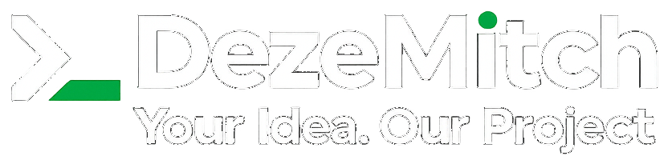

<h1 align="center">Hi 👋, I'm Mitchel</h1>
<h3 align="center">Founder of DezeMitch · Discord bots & web development</h3>

---

  

---

# 💫 About Me:

⚡ Founder of **DezeMitch** — web applications & Discord integrations 
🚀 Head Developer at **Modora** — all-in-one Discord bot with 50+ modules 
🧑‍💻 Versatile developer focused on scalable, user-focused products 
📄 Passionate about **JavaScript**, **TypeScript**, **Lua**, **PHP**, and **Next.js** — with JavaScript as my main language

---

## 🌐 Socials:

---

## 🚀 Projects:

| Project | Role | Description |
|---------|------|-------------|
| [**Modora**](https://modora.gg) | Head Developer | All-in-one Discord bot — moderation, tickets, music & more |
| [**Giftora.gg**](https://giftora.gg) | Founder | Giveaway portal for fair & engaging community events |
| [**Crafted Charms**](https://craftedcharms.nl) | Website Developer | Premium Lindt roses webshop |

---

# 💻 Tech Stack:

---

# 📊 GitHub Stats:

---

  

